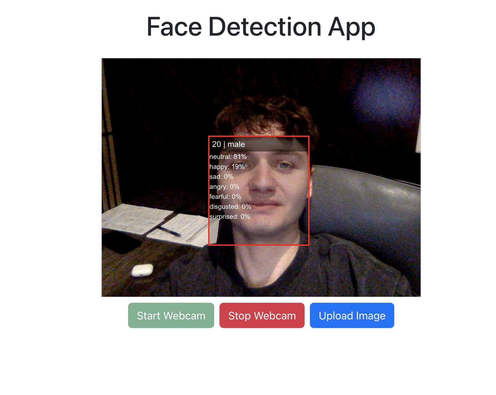
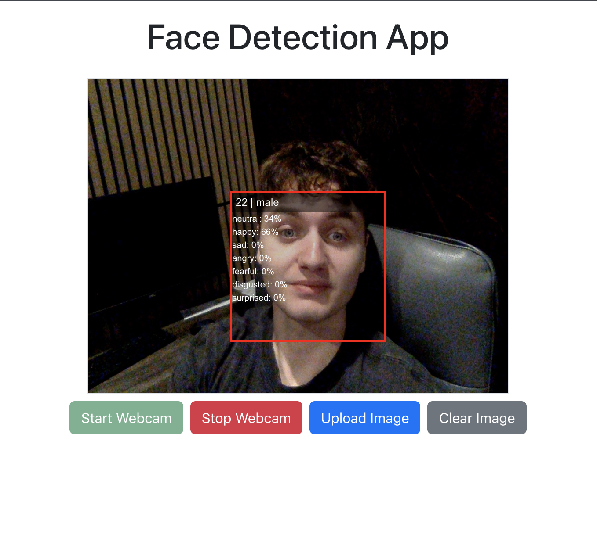

# Facial Recognition Web App


## Overview

This project is a **web application** that captures an image feed from the user's webcam and performs **real-time facial recognition** using the `face-api.js` library. The app can also detect facial expressions, age, and gender, and displays all this information with an overlay on detected faces. Users can also upload an image from their device to detect faces and expressions.

The application is built using **React, TypeScript, Redux, and Bootstrap** and is fully responsive.

---

## Features

- Start and stop webcam feed
- Detect multiple faces in real-time
- Display overlay boxes on detected faces
- Show **age**, **gender**, and **dominant emotion** for each face
- Store detected faces in **Redux state**
- Upload an image from your device and perform facial recognition
- Responsive layout that works on desktop and mobile
- Uses pre-trained models from `face-api.js` for accuracy

---

## Tech Stack

| Technology  | Usage                                   |
| ----------- | --------------------------------------- |
| React       | Frontend framework                      |
| TypeScript  | Type-safe development                   |
| Redux       | State management                        |
| Bootstrap   | Styling and layout                      |
| face-api.js | Facial recognition, age/gender/emotions |
| CSS         | Overlay styling and responsiveness      |

---

## Installation

1. Clone the repository:

git clone https://github.com/<HarutC05>/<webcam-face-recognition>.git

2. Navigate into the project folder:

cd <webcam-face-recognition>

3. Install dependencies:

npm install

4. Start the development server:

npm start

5. Open [http://localhost:3000](http://localhost:3000) in your browser.

---

## Usage

- Click **Start Webcam** to begin real-time face detection.
- Click **Stop Webcam** to stop the feed and clear detected faces.
- Upload an image using the **Upload Image** button to detect faces in any photo.
- Hover or look at faces to see **age**, **gender**, and **dominant emotion**.

---

## Project Structure

```
src/
├── app/
│   └── store.ts
├── components/
│   └── FaceOverlay.tsx
│   └── FaceOverlay.css
├── features/
│   ├── face/
│   │   ├── faceSlice.ts
│   │   └── faceService.ts
│   └── webcam/
│       ├── Webcam.tsx
│       └── webcamSlice.ts
└── App.tsx
└── App.css
└── index.tsx
└── index.css
```

---

## Screenshots


_Webcam feed with detected faces overlayed._


_Uploaded image with face detection and emotion recognition._

---

## Deployment

You can deploy this app to any static hosting or cloud platform like **Netlify, Vercel, AWS Amplify, or Heroku**.

### Example: Deploy to Netlify (Free)

1. Push your code to GitHub.
2. Go to [https://app.netlify.com/](https://app.netlify.com/) and log in.
3. Click **New site from Git** → Choose your GitHub repository → Deploy.
4. Netlify will build and host your app. You get a live URL instantly.

---

## License

This project is open-source and free to use.

---
